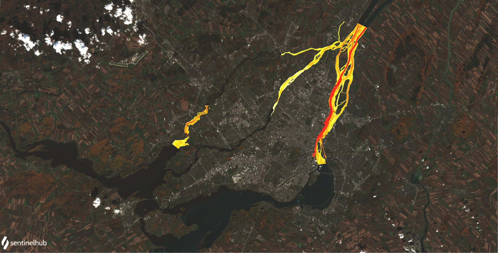

# <h1> CuteFlow
CuteFlow est un code Fortran multi-CPU multi-GPU (MPI+CUDA) de résolution des équations de St-Venant developpé à l'Ecole de Technologie supérieure de Montréal dans le groupe de recherche du [GRANIT](https://www.etsmtl.ca/recherche/laboratoires-et-chaires-ets/granit). Un guide d'utilisation peut être trouvé sur ce [lien](https://www.overleaf.com/read/qdpqbkmdbvgv).

